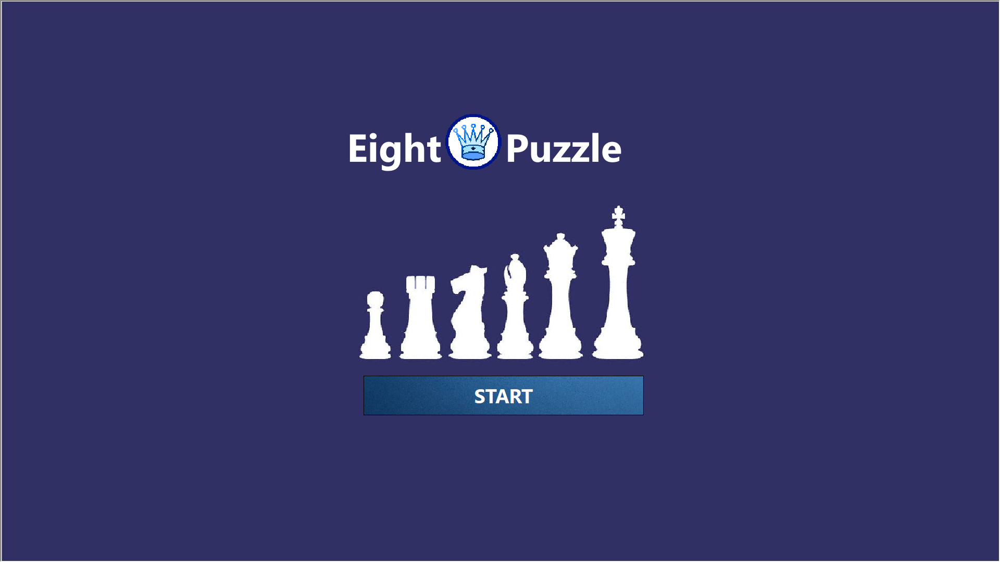
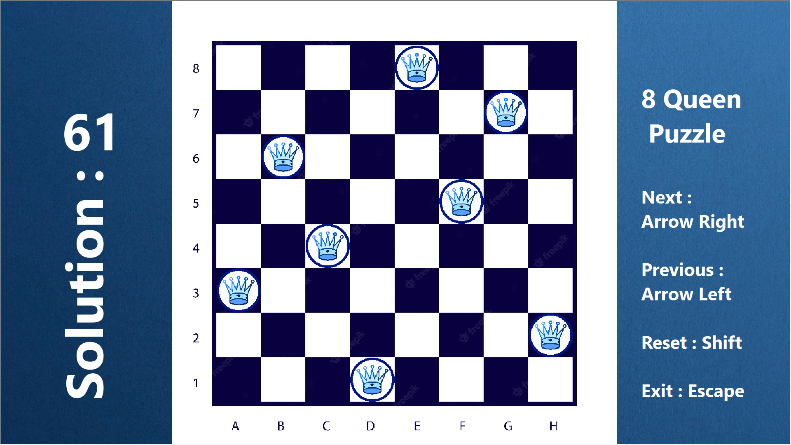

# Eight-Queen-Puzzle
The eight queens puzzle is the problem of placing eight chess queens on an 8×8 chessboard so that no two queens threaten each other; thus, a solution requires that no two queens share the same row, column, or diagonal. There are 92 solutions.It's a university project of Data Structure written in QT. 

   

